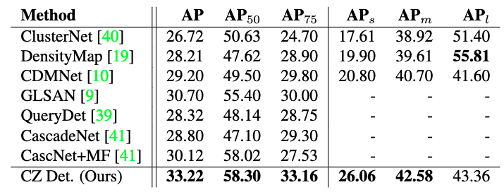

## Cascaded Zoom-in Detector for High Resolution Aerial Images

 [](https://opensource.org/licenses/MIT)

This is the PyTorch implementation of our paper: <br>
**Cascaded Zoom-in Detector for High Resolution Aerial Images**<br>
Akhil Meethal, Eric Granger, Marco Pedersoli<br>
[[arXiv](https://arxiv.org/abs/2303.08747)] [[CVPRw](https://openaccess.thecvf.com/content/CVPR2023W/EarthVision/papers/Meethal_Cascaded_Zoom-In_Detector_for_High_Resolution_Aerial_Images_CVPRW_2023_paper.pdf)]

Accepted at: CVPRw 2023 ([EarthVison Workshop](https://www.grss-ieee.org/events/earthvision-2023/?tab=aims-and-scope) oragnized by IEEE GRSS)

<p align="center">

</p>

# Installation

## Prerequisites

- Linux or macOS with Python ≥ 3.6
- PyTorch ≥ 1.5 and torchvision that matches the PyTorch installation.
- Detectron2

## Install PyTorch in Conda env

```shell
# create conda env
conda create -n detectron2 python=3.6
# activate the enviorment
conda activate detectron2
# install PyTorch >=1.5 with GPU
conda install pytorch torchvision -c pytorch
```

## Build Detectron2 from Source

Follow the [INSTALL.md](https://github.com/facebookresearch/detectron2/blob/master/INSTALL.md) to install Detectron2.

## Dataset download

1. Download VisDrone dataset

Follow the instructions on [VisDrone page](https://github.com/VisDrone/VisDrone-Dataset)

2. Organize the dataset as following:

```shell
croptrain/
└── datasets/
    └── VisDrone/
        ├── train/
        ├── val/
        ├── annotations_VisDrone_train.json
        └── annotations_VisDrone_val.json
```
The original annotations provided with the VisDrone dataset is in PASCAL VOC format. I used this code to convert it to COCO style annotation: [VOC2COCO](https://github.com/Tony607/voc2coco/blob/master/voc2coco.py)

3. Download DOTA dataset 

Please follow the instructions on [DOTA page](https://captain-whu.github.io/DOTA/dataset.html). Organize it the same way as above.

## Training

- Train the basic supervised model on VisDrone dataset

```shell
python train_net.py \
      --num-gpus 1 \
      --config-file configs/Base-RCNN-FPN.yaml \
      OUTPUT_DIR outputs_FPN_VisDrone
```

- Train the basic supervised model on DOTA dataset

```shell
python train_net.py \
      --num-gpus 1 \
      --config-file configs/Dota-Base-RCNN-FPN.yaml \
      OUTPUT_DIR outputs_FPN_DOTA
```

- Train the Cascaded Zoom-in Detector on VisDrone dataset

```shell
python train_net.py \
      --num-gpus 1 \
      --config-file configs/RCNN-FPN-CROP.yaml \
      OUTPUT_DIR outputs_FPN_CROP_VisDrone
```

- Train the Cascaded Zoom-in Detector on DOTA dataset

```shell
python train_net.py \
      --num-gpus 1 \
      --config-file configs/Dota-RCNN-FPN-CROP.yaml \
      OUTPUT_DIR outputs_FPN_CROP_DOTA
```

## Resume the training

```shell
python train_net.py \
      --resume \
      --num-gpus 1 \
      --config-file configs/Base-RCNN-FPN.yaml \
      OUTPUT_DIR outputs_FPN_VisDrone
```

## Evaluation

```shell
python train_net.py \
      --eval-only \
      --num-gpus 1 \
      --config-file configs/Base-RCNN-FPN.yaml \
      MODEL.WEIGHTS <your weight>.pth
```

## Results comparison on the VisDrone dataset

<p align="center">

</p>

## Citing Cascaded Zoom-in Detector

If you use Cascaded Zoom-in Detector in your research or wish to refer to the results published in the paper, please use the following BibTeX entry.

```BibTeX
@inproceedings{meethal2023czdetector,
    title={Cascaded Zoom-in Detector for High Resolution Aerial Images},
    author={Meethal, Akhil and Granger, Eric and Pedersoli, Marco},
    booktitle={CVPRw},
    year={2023},
}
```

Also, if you use Detectron2 in your research, please use the following BibTeX entry.

```BibTeX
@misc{wu2019detectron2,
  author =       {Yuxin Wu and Alexander Kirillov and Francisco Massa and
                  Wan-Yen Lo and Ross Girshick},
  title =        {Detectron2},
  howpublished = {\url{https://github.com/facebookresearch/detectron2}},
  year =         {2019}
}
```

## License

This project is licensed under [MIT License](LICENSE), as found in the LICENSE file.
